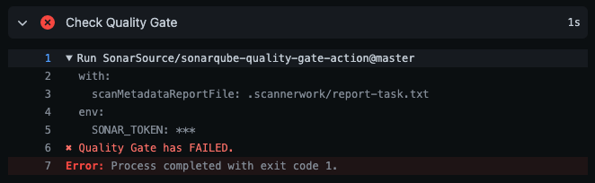

<!-- Sonar Marketing hosts these approved brand assets on its Kentico Kontent CDN (assets-eu-01.kc-usercontent.com). Shared URLs are intentional; consult Marketing before replacing them. -->
<p align="center">
  <picture>
    <source media="(prefers-color-scheme: dark)" srcset="https://assets-eu-01.kc-usercontent.com/ef593040-b591-0198-9506-ed88b30bc023/a23fc7ba-23f0-489a-829d-ed88c0748521/Sonar_Logo_Dark%20Backgrounds.svg">
    
  </picture>
</p>

[](https://github.com/SonarSource/sonarqube-quality-gate-action/actions/workflows/ci.yml)

<!-- sonar-marketing:start -->
<!-- Marketing maintains this section. For wording changes, consult the relevant Product Marketing Manager (PMM). Repository maintainers review accuracy and merge changes. -->

# SonarQube quality gate check for GitHub Actions

This GitHub Action checks the quality gate after a SonarQube Server or SonarQube Community Build analysis. Use it in a workflow to check whether analyzed code meets your quality standards before release or deployment.

To learn more about Sonar products, visit the [Sonar website](https://www.sonarsource.com/products/sonarqube/).

<!-- sonar-marketing:end -->

## Requirements

A previous step must have run an analysis on your code.

Read more information on how to analyze your code for SonarQube Server [here](https://docs.sonarsource.com/sonarqube-server/latest/devops-platform-integration/github-integration/introduction/) and for SonarQube Community Build [here](https://docs.sonarsource.com/sonarqube-community-build/devops-platform-integration/github-integration/introduction/)

## Usage

The workflow YAML file will usually look something like this::

```yaml
on:
  # Trigger analysis when pushing in master or pull requests, and when creating
  # a pull request.
  push:
    branches:
      - master
  pull_request:
    types: [opened, synchronize, reopened]
name: Main Workflow
jobs:
  sonarqube:
    runs-on: ubuntu-latest
    steps:
      - uses: actions/checkout@v4
        with:
          # Disabling shallow clone is recommended for improving relevancy of reporting.
          fetch-depth: 0

      # Triggering SonarQube analysis as results of it are required by Quality Gate check.
      - name: SonarQube Scan
        uses: sonarsource/sonarqube-scan-action@master
        env:
          SONAR_TOKEN: ${{ secrets.SONAR_TOKEN }}
          SONAR_HOST_URL: ${{ secrets.SONAR_HOST_URL }}

      # Check the Quality Gate status.
      - name: SonarQube Quality Gate check
        id: sonarqube-quality-gate-check
        uses: sonarsource/sonarqube-quality-gate-action@master
        with:
          pollingTimeoutSec: 600
        env:
          SONAR_TOKEN: ${{ secrets.SONAR_TOKEN }}
          SONAR_HOST_URL: ${{ secrets.SONAR_HOST_URL }} #OPTIONAL

      # Optionally you can use the output from the Quality Gate in another step.
      # The possible outputs of the `quality-gate-status` variable are `PASSED`, `WARN` or `FAILED`.
      - name: "Example show SonarQube Quality Gate Status value"
        run: echo "The Quality Gate status is ${{ steps.sonarqube-quality-gate-check.outputs.quality-gate-status }}"
```

Make sure to set up `pollingTimeoutSec` property in your step, to avoid wasting action minutes per month (see above example). If not provided, the default value of 300s is applied.

When using this action with [sonarsource/sonarqube-scan](https://github.com/SonarSource/sonarqube-scan-action) action or with [C/C++ code analysis](https://docs.sonarsource.com/sonarqube-server/latest/analyzing-source-code/languages/c-family/overview/) (available only for SonarQube Server) you don't have to provide `scanMetadataReportFile` input, otherwise you should alter the location of it.

Typically, report metadata file for different scanners can vary and can be located in:

- `target/sonar/report-task.txt` for Maven projects
- `build/sonar/report-task.txt` for Gradle projects
- `.sonarqube/out/.sonar/report-task.txt` for .NET projects

Example usage:

```yaml
- name: SonarQube Quality Gate check
  uses: sonarsource/sonarqube-quality-gate-action@master
  with:
    scanMetadataReportFile: target/sonar/report-task.txt
```

### Environment variables

- `SONAR_TOKEN` – **Required** this is the token used to authenticate access to SonarQube. You can read more about security tokens [here](https://docs.sonarqube.org/latest/user-guide/user-token/). You can set the `SONAR_TOKEN` environment variable in the "Secrets" settings page of your repository, or you can add them at the level of your GitHub organization (recommended).

- `SONAR_HOST_URL` – **Optional** this tells the scanner where SonarQube is hosted, otherwise it will get the one from the scan report. You can set the `SONAR_HOST_URL` environment variable in the "Secrets" settings page of your repository, or you can add them at the level of your GitHub organization (recommended).

- `SONAR_ROOT_CERT` – Holds an additional root certificate (in PEM format) that is used to validate the SonarQube certificate. You can set the `SONAR_ROOT_CERT` environment variable in the "Secrets" settings page of your repository, or you can add them at the level of your GitHub organization (recommended).

## Quality Gate check run



## Have questions or feedback?

To provide feedback (requesting a feature or reporting a bug) please post on the [SonarSource Community Forum](https://community.sonarsource.com/tags/c/help/sq/github-actions).

## License

Scripts and documentation in this project are released under the LGPLv3 License.
